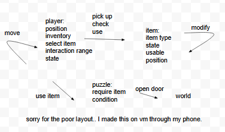
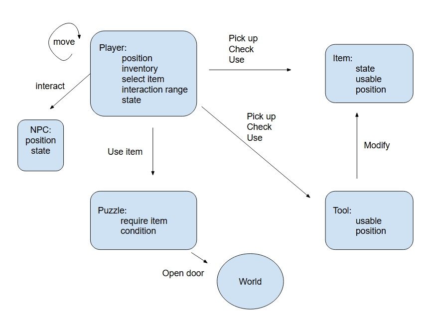

# GDIM 33 In-Class Activities
### Pin Hsuan Wang
## W1
### Activity 1
[here is my inspo](https://docs.google.com/drawings/d/1bHQspzC-nP5P-pQtukpK7AowgIn8o3clHfYRSoLQpQc/edit?usp=sharing)

1. I am fascinated by detective games and solving mysteries.A pattern I notice is that I enjoy games that involve investigation, storytelling, and uncovering clues.
2. At my table, there is a classmate who likes visual novels, which is one of the detective game genres I play the most. We both enjoy story-driven games and character interactions.
2. One of the LAs likes games such as Minecraft and Fortnite, which are quite different from mine. However, some concepts, like exploration, are the same.

### Activity 2

## W2
Write your W2 Devlog here.

Continue adding additional headers below this one for future weeks and future activities.

## W3

### Activity 1

### Activity 2

1. Why is it advantageous to save the event name for the explore-to-dialogue state transitions as Scene variable ("clickNpcEventName")?
It is easier to mangage and use in different scene.
2. Describe how using at least one Debug.Log() node helped you test your Graphs at an intermediate step.
I could use Debug.Log() node to help me check if the event being trigger succeesfully. I can use it when a dialog pop out and cursor is being unlock.
3. Is the Set Cursor Lock State relevant to your Vertical Slice? Why or why not?
Yes, it is related to my Vertical Slice. I use it when player access to the solving puzzle interface. 
4. Is the concept of a "game state" relevant to your Vertical Slice? Why or why not?
Yes, I need to manage puzzle by changing game state, to make sure which puzzle is solved and which isn't.

## W3

### Activity 1
In my build, player can move left and right, and interact with the object

My goal is let team members do the movement and interaction

My playtest team members:
Rebecca 
Andrew
Sonia Mangat

Note:
The left/right movement can't stop until push arrow up/down.

### Activity 2
1. Assuming this activity is completed by a programmer, could a writer add more dialogue to this setup without writing any code? Why or why not?
Yes, through adding nodes and new Scriptable Objects, it is easy to add more dialogue.

2. What limit is there to the number of dialogue nodes that the writer could create without writing any code?
Since it is posiible to make a dialogue loop, the writer can create endless amout of dialogue.

3. In your own words, describe the purpose of the "Regenerate Nodes" button.
Regenerate Nodes allow us to build the graph node what we have defined in C# code.

### Bonus
attach a screenshot of the visual you created.

### MileStone1

1. 
I use OnTriggerEnter2D and OnTriggerExit2D to detect whether player is close emough to pick up tool. If it's close enough, canPickTool set as True, allows player picks up tool.

2.

In this milestone, I updated my game break-down by integrating a State Machine system to manage player behavior more clearly and modularly. Previously, movement and interaction logic were loosely connected, but now they are organized into defined states such as Idle, Moving, and Interaction. The movement state is activate by the Unity Input System using a Vector2 input from input events, allowing movement control. For interaction, I added trigger detection using OnTriggerEnter2D and OnTriggerExit2D, combined with boolean checks to determine whether the player is within range of an interactable object and able to pick up or use a tool. This update improves readability and scalability compared to handling everything in a single flow.

The State Machine works by transitioning between states based on player input, collision events, and internal conditions. For example, when the player provides movement input, the state switches from Idle to Moving, and when entering an interactable zone, the system enables the Interaction state if conditions are met. This State Machine is connected to Input System for movement control, the Physics system for trigger detection, and the interaction/puzzle system for enabling tool usage and puzzle activation.

## W5

### Activity 1

Character will reflect player movement with animations such as idle, walking, and running.
#### Basic steps
1. Download and add animations into Unity.
2. Code the state machine (SM) and test transitions between states using debug logs only.
3. Use the state machine to control animation changes.
#### Substeps
1. Download the character asset
2. Slice it into different frames
3. Set the images as sprites
4. Use the Animation window to create animation clips
5. Use the Animator to control animation transitions
6. Use nodes to detect player input
7. Connect player input to Animator variables

### Activity 2

I fininshed steps 1 to 5. I am still trying to make animation mirrow when character walks on the other side.

## W6

### Activity 1

Since last milestone, I changed a little bit movement logic, and added the animation
My playtest goal is: 
1. To make sure the movement is funtional.
2. Check the character animation is same as the input.
Feedback:
1. Add matirial will show clearer about what to do.
2. Add the description: you have to get the tool to open the door.
### Activity 2

1. Multiply Mode literally multiply on each RGB value, it's between 0-1, which means multiply whould always result in smaller value, causing color darker and less saturated.

2. More translucent. The Alpha value would be lower after multiply, so the lower Alpha is, the more translucent the color is. 

3. It comes from vertex data of the UV mesh, 

4. YES! Now I can modify material of the color and texture.

## W7

### Activity Devlog

1. The data for the Vertex Color node come from Shiba mesh.
2. It's blended because each vertex has color, and it interpolated color value at the edge.
3. We are using mesh this time, it is less detail than texture. When the texture are similar, mesh is more simple to render and faster.
4. It doesn't blend, the whole render color is different from the vertex normal.
5. UV mesh. It applys the color R & G between 0-1 to show the position of the texture should be on the 3d model.
6. Because Shiba's surface normal are not perpendicular to the surface.
7. Additive add the color value on base color, so it makes the color brighter. 

## W8

### Activity 1

#### What's new
- New build Scene 
- Snow Partical Effect

Link: https://eraser2234.itch.io/find-grandma30

Playtest goal
- Player can use the inventory 
- The animation is work
Playtest feedback
- The character movement is a bit laggy
- It would be good if the item can pop up when player touch the item. 
- The inventory would be better if it show which item is be picked or didn't pick any.

### Activity 2

Activity 2B
1. How is the Fraction node used to animate the shine effect?

2. Why does the Shine texture for the ShinySprite shader need to be BLACK by default? Consider that we're using the Add Node to combine it with the original texture...

3. Why isn't the building texture we used in the ShaderGraph applied to all of the Sprites that use the ShinySprite shader?

4. Why do we multiply fraction(time * ShineSpeed) with the speed variable inside the fraction instead of outside- as in fraction(time)*speed? If you're not sure, try modifying your graph to multiply the Fraction node with ShineSpeed instead of multiplying Time with ShineSpeed, and see what happens.